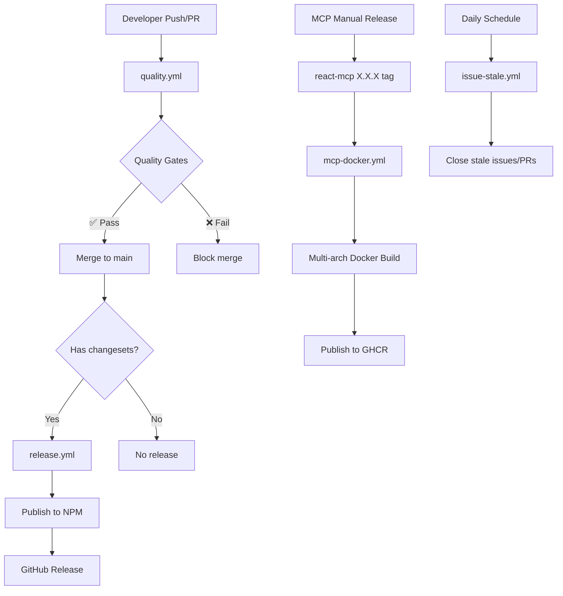

# GitHub Workflows

> Automated CI/CD system for the Chakra UI monorepo

## 🏗️ System Architecture

## 📋 Workflows Overview

| Workflow                                   | Trigger                                        | Purpose                        |
| ------------------------------------------ | ---------------------------------------------- | ------------------------------ |
| [`quality.yml`](#quality-assurance)        | Push/PR                                        | CI validation for all packages |
| [`release.yml`](#package-publishing)       | Changeset merge                                | NPM publishing (excludes MCP)  |
| [`mcp-docker.yml`](#mcp-docker-publishing) | `@chakra-ui/react-mcp@*` tag + manual dispatch | Docker images to GHCR          |
| [`issue-stale.yml`](#issue-management)     | Daily cron                                     | Automated issue cleanup        |

---

## 🔍 Workflow Details

### Quality Assurance

**File:** `quality.yml` | **Triggers:** Push/PR

Runs `pnpm build`, `test`, `lint`, `typecheck`, `format:check` in parallel.
Blocks merge on failure.

---

### Package Publishing

**File:** `release.yml` | **Triggers:** Changeset merge to `main`

Automated NPM publishing via changesets. **Excludes:** `@chakra-ui/react-mcp`,
sandbox apps.

---

### MCP Docker Publishing

**File:** `mcp-docker.yml` | **Triggers:** `@chakra-ui/react-mcp@*` tags +
manual dispatch

Multi-arch Docker builds (`linux/amd64` + `linux/arm64`) to
`ghcr.io/chakra-ui/chakra-ui/react-mcp`. Supports dry-run testing.

---

### Issue Management

**File:** `issue-stale.yml` | **Triggers:** Daily 1 AM UTC

Auto-closes stale issues (30+7 days) and PRs (15+7 days). **Exempt:** `roadmap`,
`feature`, `bug` labels.

---

## 🚀 Developer Guide

### Contributors

- **PR validation:** Fix `pnpm lint`, `test`, `typecheck` failures before merge
- **Releases:** Add changeset (`pnpm changeset`) → auto-publish on merge

### MCP Maintainers

- **Release:** `cd apps/mcp && pnpm release` (needs `NPM_TOKEN` in `.env`)
- **Result:** NPM package + tag → triggers Docker build to GHCR

### Repository Maintainers

**Monitor:** Actions tab for failures | **Secrets:** `SAGE_PAT`, `NPM_TOKEN`,
`SLACK_WEBHOOK_URL`

---

## 📚 Related Documentation

- **Main packages:**
  [Changesets workflow](https://github.com/changesets/changesets)
- **MCP server:** [`apps/mcp/README.md`](../../apps/mcp/README.md)
- **Docker usage:** [`apps/mcp/Docker.md`](../../apps/mcp/Docker.md)
- **Composite actions:**
  [`../.github/composite-actions/`](../composite-actions/)
